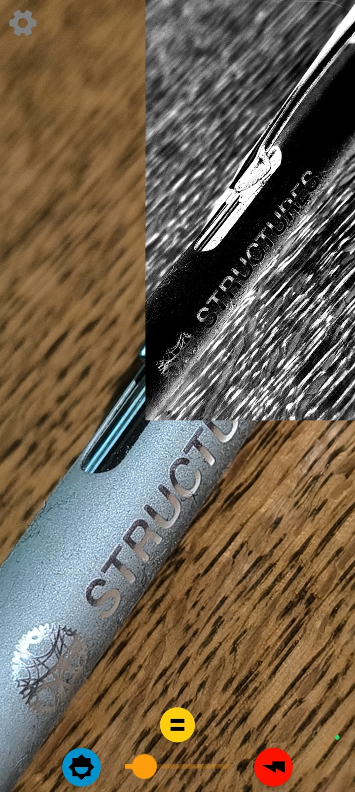
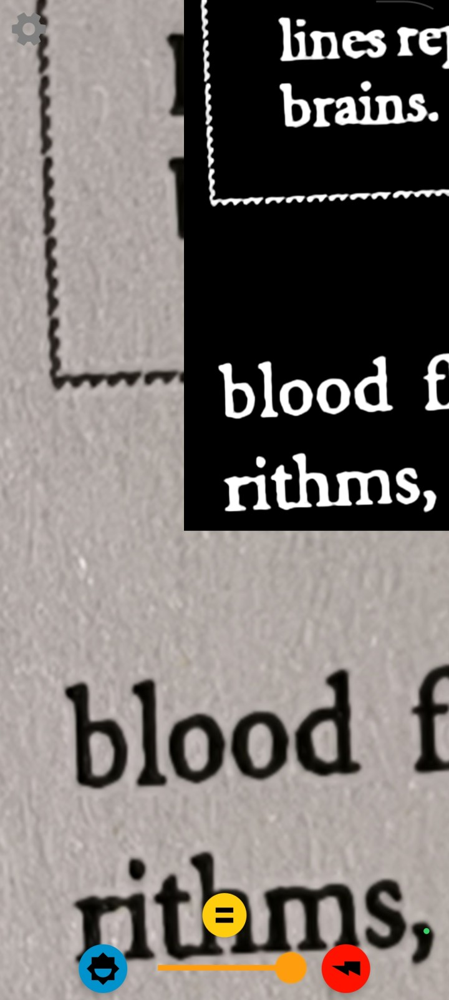

# Magnifying Glass

Forked from https://github.com/kloener/visor-android

*Magnifying Glass* transforms your Android device into a simple, powerful magnifier for low-vision use. Enlarge hard-to-read text with the live camera preview, zoom in for extra clarity, and enhance visibility with high-contrast color modes optimized for printed text. Pause the image anytime and save it for later reference.

## Screenshots

  
  

## License

Copyright (c) 2015 Christian Illies

Licensed under the Apache License, Version 2.0 (the "License");
you may not use this file except in compliance with the License.
You may obtain a copy of the License at

http://www.apache.org/licenses/LICENSE-2.0

Unless required by applicable law or agreed to in writing, software
distributed under the License is distributed on an "AS IS" BASIS,
WITHOUT WARRANTIES OR CONDITIONS OF ANY KIND, either express or implied.
See the License for the specific language governing permissions and
limitations under the License.

Modified by [@cvzi](https://github.com/cvzi).

### App Icon

From [Google Fonts](https://fonts.google.com/icons), Apache License, Version 2.0
